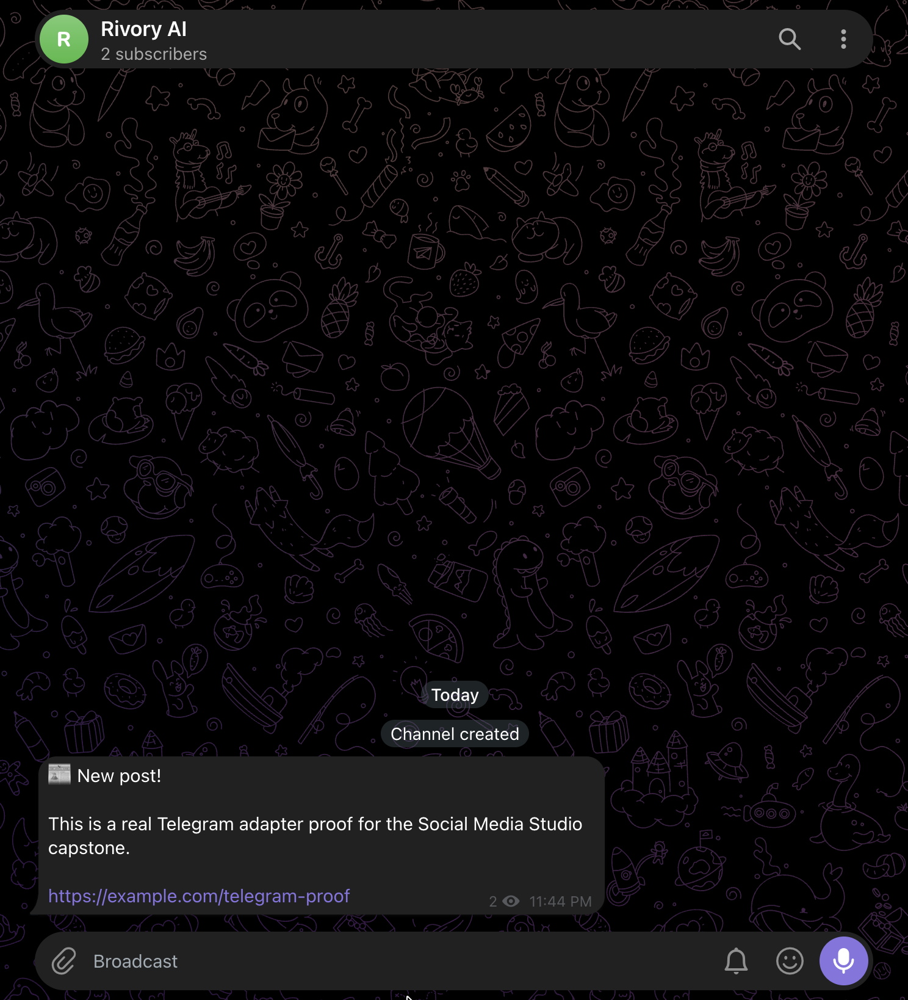

# Evidence

This file maps each graded requirement from the capstone brief to proof captured during the build.
All results below are from actual runs.

## 1. Ingestion: URL fetched or Markdown pasted, then stored

### Markdown ingestion

```text
$ curl -s -X POST localhost:3000/posts -H "Content-Type: application/json" -d '{
  "sourceType":"markdown",
  "sourceValue":"https://example.com/my-post",
  "body":"This is a long blog post about backend architecture and idempotent systems."
}'

201
{
  "id": 1,
  "source_type": "markdown",
  "source_value": "https://example.com/my-post",
  "body": "This is a long blog post about backend architecture and idempotent systems.",
  "created_at": "2026-08-31 11:10:33"
}
```

### Markdown without a body is rejected

```text
$ curl -s -X POST localhost:3000/posts -H "Content-Type: application/json" -d '{
  "sourceType":"markdown","sourceValue":"x"
}'

400 {"detail": "body is required when sourceType is 'markdown'"}
```

### URL ingestion

An invalid placeholder URL failed loudly:

```text
$ curl -s -X POST localhost:3000/posts -H "Content-Type: application/json" -d '{
  "sourceType":"url",
  "sourceValue":"https://<a real blog post URL you control or trust>"
}'

{"detail":"could not fetch that URL: HTTPSConnectionPool(... Failed to resolve ...)"}
```

A real LinkedIn URL was fetched and stored:

```text
$ curl -s -X POST localhost:3000/posts -H "Content-Type: application/json" -d '{
  "sourceType":"url",
  "sourceValue":"https://lnkd.in/p/dQeSfJff"
}'

{"id":2,"source_type":"url","source_value":"https://lnkd.in/p/dQeSfJff",
 "body":"Standardize Audio for Improved Whisper Transcription Accuracy | Ria Arora posted ...",
 "created_at":"2026-08-31 11:15:17"}
```

Known limitation: the current BeautifulSoup extraction also captures LinkedIn navigation,
sign-in text, comments, and unrelated "More Relevant Posts" content. The fetch-and-store path
works end-to-end, but the extraction is intentionally documented as best-effort.

## 2. Constraint profiles: enforced in code

A rule-breaking X variant is blocked and the exact broken rule is named:

```text
>>> validate_variant('x', 'short text #a #b #c #d #e #f')
{'ok': False, 'reason': 'hashtag count 6 exceeds max 2 for x'}
```

The same check was reproduced in the real smoke test:

```text
--- 2b. rule-breaking variant is blocked (too many hashtags) ---
{'ok': False, 'reason': 'hashtag count 6 exceeds max 2 for x'}
```

A valid generation run created two platform variants with none blocked:

```text
201 {
  'created': [
    {'id': 1, 'post_id': 1, 'platform': 'x',
     'content': 'This is a long blog post about backend architecture and idempotent systems. #blog',
     'status': 'draft', ...},
    {'id': 2, 'post_id': 1, 'platform': 'linkedin',
     'content': 'This is a long blog post about backend architecture and idempotent systems.

Read the full post: https://example.com/my-post

#Insights #Growth',
     'status': 'draft', ...}
  ],
  'blocked': []
}
```

## 3. Review workflow: only approved variants can be scheduled

Real smoke-test output:

```text
--- 3. schedule BEFORE approval must be 4xx ---
409 {'detail': 'variant 1 is "draft", not "approved" — only approved variants can be scheduled'}

--- 3b. approve then schedule succeeds ---
approve: 200 approved
schedule: 201 {'slot': {'id': 1, 'variant_id': 1,
'scheduled_at': '2020-01-01 00:00:00',
'created_at': '2026-08-31 13:56:53'}, 'idempotencyKey': 'v1-s1'}
```

A separate real Telegram variant was also approved before scheduling:

```text
$ curl -s -X PATCH localhost:3000/variants/2/approve

{"id":2,"post_id":3,"platform":"telegram",
"content":"📰 New post!

This is a real Telegram adapter proof for the Social Media Studio capstone.

[https://example.com/telegram-proof](https://example.com/telegram-proof)",
"status":"approved",
"created_at":"2026-08-31 17:43:32",
"updated_at":"2026-08-31 17:44:33"}
```

## 4. Adapter layer: interface, real adapter, two mocks, configuration-only swap

The automated smoke test proved the adapter registry can change the implementation through
configuration:

```text
--- 6. adapter swap via env, zero code change ---
adapter used for 'telegram': MockXPublisher
```

The configured architecture is:

```text
SocialPublisher
+-- TelegramPublisher
+-- MockXPublisher
+-- MockLinkedInPublisher
```

The application uses the adapter interface, while the platform implementation is selected by
`PLATFORM_ADAPTER_MAP`.

## 5. Idempotent publish: same variant + slot publishes exactly once under a race

Real smoke-test output from three concurrent Python threads:

```text
--- 4/5. idempotent publish: call publish_slot 3x concurrently (real threads) ---
[scheduler] published variant 1 to x: [MOCK X PREVIEW] "This is a long blog post about backend architecture and idem..."
[scheduler] slot 1 already claimed, skipping (idempotency held)
[scheduler] slot 1 already claimed, skipping (idempotency held)
publish_attempts rows for this slot (must be exactly 1): 1
{'id': 1, 'idempotency_key': 'v1-s1', 'variant_id': 1, 'slot_id': 1,
 'platform': 'x', 'status': 'success',
 'result': '{"external_id": "mock-x-1", "preview_url": "[MOCK X PREVIEW] ..."}',
 'created_at': '2026-08-31 13:56:53',
 'updated_at': '2026-08-31 13:56:53'}
```

The same smoke test was run twice, at 13:54:01 and 13:56:53, with identical one-row results.

## 6. Durable scheduling: crash recovery produces no duplicate

The automated crash-recovery test was run successfully:

```text
before recovery: [{'id': 1, 'idempotency_key': 'v1-s1', 'variant_id': 1,
 'slot_id': 1, 'platform': 'x', 'status': 'in_progress',
 'result': None, 'created_at': '2026-08-31 14:00:36',
 'updated_at': '2026-08-31 13:00:36'}]

[scheduler] recovering stale attempt 1 (variant 1)

after recovery (must still be exactly 1 row, status success): [{'id': 1,
 'idempotency_key': 'v1-s1', 'variant_id': 1, 'slot_id': 1,
 'platform': 'x', 'status': 'success',
 'result': '{"external_id": "mock-x-1", "preview_url": "[MOCK X PREVIEW] \"crash test content...\""}',
 'created_at': '2026-08-31 14:00:36',
 'updated_at': '2026-08-31 14:00:36'}]

mock_x_posts count (must be exactly 1 — no duplicate): 1
```

The stale attempt was recovered in place.

## 7. Publish history: every attempt and result is visible

Final real Telegram publish output:

```text
$ curl -s localhost:3000/history

[{"id":3,"idempotency_key":"v2-s6","platform":"telegram","status":"success",
"result":"{\"external_id\": \"2\", \"preview_url\": \"telegram message_id=2 chat=@ria_social_studio\"}",
"created_at":"2026-08-31 18:14:18","updated_at":"2026-08-31 18:14:24",
"content":"📰 New post!

This is a real Telegram adapter proof for the Social Media Studio capstone.

[https://example.com/telegram-proof](https://example.com/telegram-proof)",
"variant_id":2},
{"id":2,"idempotency_key":"v2-s5","platform":"telegram","status":"failed",
"result":"{\"error\": \"TELEGRAM_BOT_TOKEN or TELEGRAM_CHAT_ID missing from .env\"}",
"created_at":"2026-08-31 18:10:15","updated_at":"2026-08-31 18:10:15",
"content":"📰 New post!

This is a real Telegram adapter proof for the Social Media Studio capstone.

[https://example.com/telegram-proof](https://example.com/telegram-proof)",
"variant_id":2},
{"id":1,"idempotency_key":"v1-s1","platform":"x","status":"success",
"result":"{\"external_id\": \"mock-x-1\", \"preview_url\": \"[MOCK X PREVIEW] \\\"crash test content...\\\"\"}",
"created_at":"2026-08-31 14:00:36","updated_at":"2026-08-31 14:00:36",
"content":"crash test content","variant_id":1}]
```

This demonstrates that `/history` records both failed and successful attempts and their results.

## 8. Real target: Telegram

The real Telegram adapter was configured, a Telegram variant was generated, approved, scheduled,
and successfully published.

Telegram variant creation:

```text
{"created":[{"id":2,"post_id":3,"platform":"telegram",
"content":"📰 New post!

This is a real Telegram adapter proof for the Social Media Studio capstone.

[https://example.com/telegram-proof](https://example.com/telegram-proof)",
"status":"draft"}],"blocked":[]}
```

Approval:

```text
{"id":2,"post_id":3,"platform":"telegram",
"status":"approved"}
```

Scheduling created slot `6`:

```text
{"slot":{"id":6,"variant_id":2,
"scheduled_at":"2026-08-31 18:14:15",
"created_at":"2026-08-31 18:12:15"},
"idempotencyKey":"v2-s6"}
```

The worker then published the message:

```text
[scheduler] published variant 2 to telegram: telegram message_id=2 chat=@ria_social_studio
```

The actual Telegram success result is recorded in `/history`:

```text
"platform":"telegram"
"status":"success"
"result":"{"external_id": "2", "preview_url": "telegram message_id=2 chat=@ria_social_studio"}"
```

The Telegram channel screenshot was also captured as visual confirmation of the real message.


## 9. Secrets clean

The required Git-history check produced no output:

```text
$ git log --all --full-history -- .env

```

The ignore check confirmed `.env` is ignored:

```text
$ git check-ignore -v .env

.gitignore:4:.env       .env
```

The tracked example file was confirmed:

```text
$ git ls-files .env.example

.env.example
```

Therefore `.env` does not appear in Git history, `.env` is ignored, and `.env.example` is tracked.

## Final self-check

- [x] Ingestion: URL and Markdown paths demonstrated
- [x] Constraint profiles enforced and blocked rule demonstrated
- [x] Review workflow and approval gate demonstrated
- [x] Adapter layer and configuration-only swap demonstrated
- [x] Idempotent concurrent publish demonstrated
- [x] Durable crash-recovery mechanism demonstrated
- [x] Publish history demonstrated
- [x] Real Telegram publish demonstrated
- [x] `.env` clean verification demonstrated
- [x] Final Telegram success and visual confirmation captured

All the checkboxes as completed as per me.